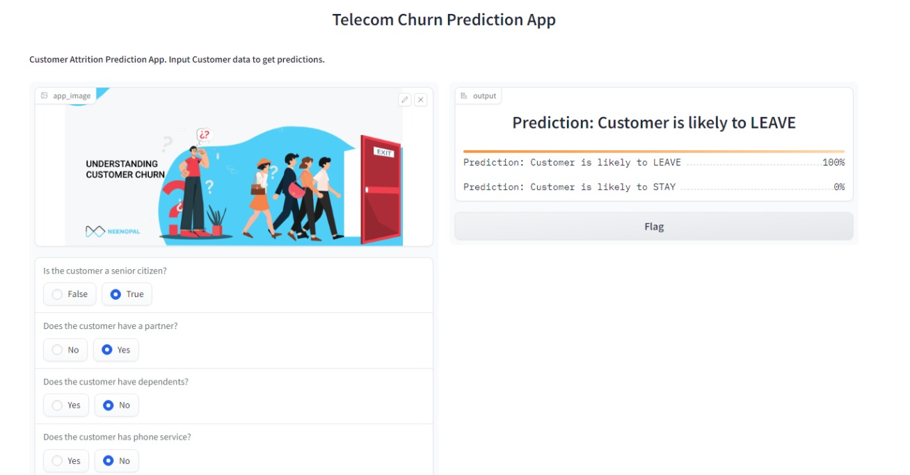

## Gradio App - Store Sales Prediction for Corporation Favorita

Welcome to the Gradio Machine Learning Model Embedding Project using Gradio! This project demonstrates how to embed a machine learning model to predict customer churn for Vodafone Telecom, a telecommunications company. The Gradio app provides an interactive interface for users to input variables and obtain churn prediction.

### Article
| Code      | Name        | Published Article |  Deployed App |
|-----------|-------------|:-------------:|------:|
| LP4  | Medium |  [https://medium.com/@benjaminkipkem/embedding-a-machine-learning-model-into-gui-using-gradio-810013faebb8](/) | [Best Article Machine learning](/) |

### Usage

To use the Gradio app for customer churn prediction, follow these steps:

1. Install the required dependencies (see Installation section below).
2. Run the Gradio app: `myapp.py`.
3. Input relevant variables for SeniorCitizen, Partner, Dependents, tenure, PhoneService, MultipleLines etc.

The app will display the predicted output for the specified input variables as shown in the image above.

### Installation

To run the Gradio app locally for customer churn prediction, follow these steps:

1. Clone this repository: `https://github.com/kaitany/Gradio_Project-Embedding_a_ML-Model_into_GUI.git`
2. Navigate to the project folder: `cd your_repository`
3. Install the required dependencies: `pip install -r requirements.txt`
4. Run the Gradio app: `myapp.py`

## Contributing

Contributions are welcome! If you find any issues or have suggestions, please feel free to open an issue or submit a pull request.

## License

This project is licensed under the [<https://www.gnu.org/licenses/>](LICENSE).

---

  Made by Benjamin Kaitany

